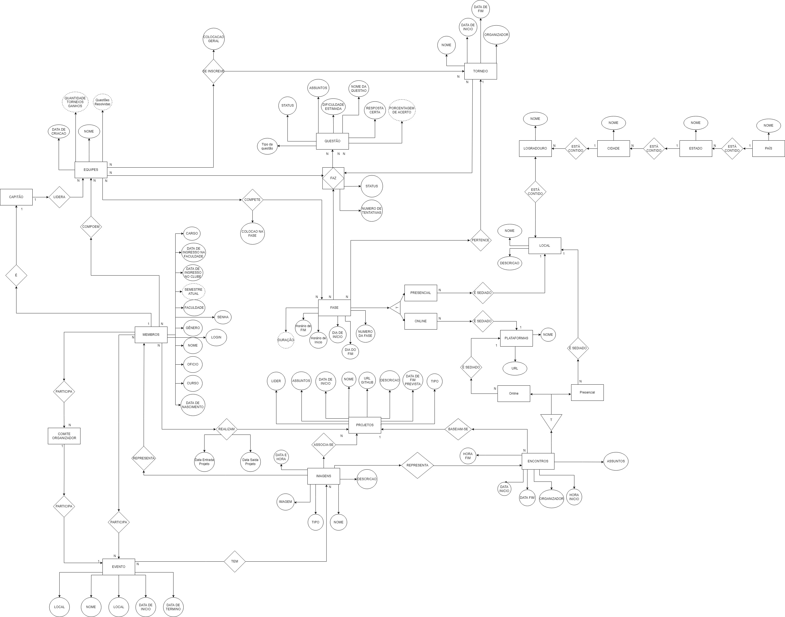

<h1 align="center">🦆 Programing Club Relational Database 🦆</h1>

	<a href="https://github.com/ClubeProgramacaoSSA">
	

## Developed by:
- [Adrian Widmer](https://github.com/Awi-24)
- [Antonio Horácio Magalhaes](https://github.com/antoniohoracio77)
- [Fernando Antonio Marques Schettini](https://github.com/FernandoSchett)
- [João Pedro Moreira de Almeida Santos](https://github.com/joao7878)
- [Orlando Mota Pires](https://github.com/orlandomotapires)

## Description:

&emsp;&emsp;&emsp;This Relational DataBase, made in SQL, is a project made for Clube de Programação, an student initiative, from SENAI CIMATEC and as a end of Database subject project. Its been developed by members of the club with the purpose for acting as a managent tool for the activites conducted on the initiative. Members, tournaments, workshops... those datas are the things the Database is going to store.

## The Future:

&emsp;&emsp;&emsp;We plan to get these DataBase as a studie objet for other members that want to study SQL and Data Modeling. Besides that we also plan to conect the database with our Website, that we will create on the Future. 

## Documentation:
<i>*All DataBase Documentation  is also present at and .pdf arquive on the Repository.</i>

<h3>1. The Conceptual Data Model</h3>
	
&emsp;&emsp;&emsp;The following is the conceptual data model, in which the database is represented in a more superficial and abstract way, to facilitate general understanding. The model was developed using the DER (Entity Relationship Diagram) methodology.

	

 

<h3>2. The Relational Data Model</h3>
	
&emsp;&emsp;&emsp;Below is the relational data model, in which a schematic of the database is represented, with the tables, attributes and associative tables that will be in the final database:
	

	

 
	
<h3>3. Data Dictionary</h3>	
	
&emsp;&emsp;&emsp;The dictionary contains each attribute of each table with his description and a domain constraint. The dictionary will be avaliable at the repository.
	 &emsp;&emsp;&emsp;<i>*In the domain restriction, there may be the following characteristics:</i>
	 = PK;
	 = FK;
	 = Not null;
	 = Check;
	 = Default; 
    	 = Unique.
	
<h3>4. SCRIPT</h3>
	
&emsp;&emsp;&emsp;Following the database script, it contains all the manufacturing products to bring the design database to life.	
&emsp;&emsp;&emsp;The project Script is composed of three main SQL files: the first file, DML.sql, responsible for creating the database tables, the DDLsql file, responsible for filling the database with fictitious data and, finally, the Consultas_BD_Clube_Programacao.sql file which is composed of three models for reports within the database.

<h3>5. BANK REPORTS</h3>
	
	
About the Bank Reports:
	
<h4><b>- First proposal:</b> <ins>Tournament Report.</ins> </h4>

&emsp;&emsp;&emsp;A report built on the basis of informing about a certain tournament, our scope for consultation will result in: name of the tournament, how many phases made up the tournament, the name of the teams that participated in the tournament, its members, the name of its captain, its placements, questions they got wrong and which they got right, how many attempts it took, questions that were applied in the tournament, their subjects, estimated difficulty.
	
<b>- Second proposal:<b> <ins>Report of meetings held in a specific month.</ins>
	
&emsp;&emsp;&emsp;A report built on the basis of reporting on the club's activity in a certain month, our scope for consultation will result in: Date and time of the meeting, members present, the subject of the meeting, organizer of the meeting, description of the results that were discussed, modality (in person or online), place where the meeting was held or platform (if online).
	
<b>- Third proposal:</b> <ins>Project report.</ins>
	
&emsp;&emsp;&emsp;A report built on the basis of reporting on the status of a project's progress, our scope for query will result in: Project status (progress), project name, project objective, project team members, project leader, start date, expected end date, effective end date (if any), project description.

<h3>6. REFERENCES</h3>
	
[1] SOUSSA, Marcio. SQL. 22 de junho de 2022.
	
[2] SQL Tutorial, W3 School. Avaliable in: <https://www.w3schools.com/sql/default.asp>. Access in em 22 de junho de 2022.

